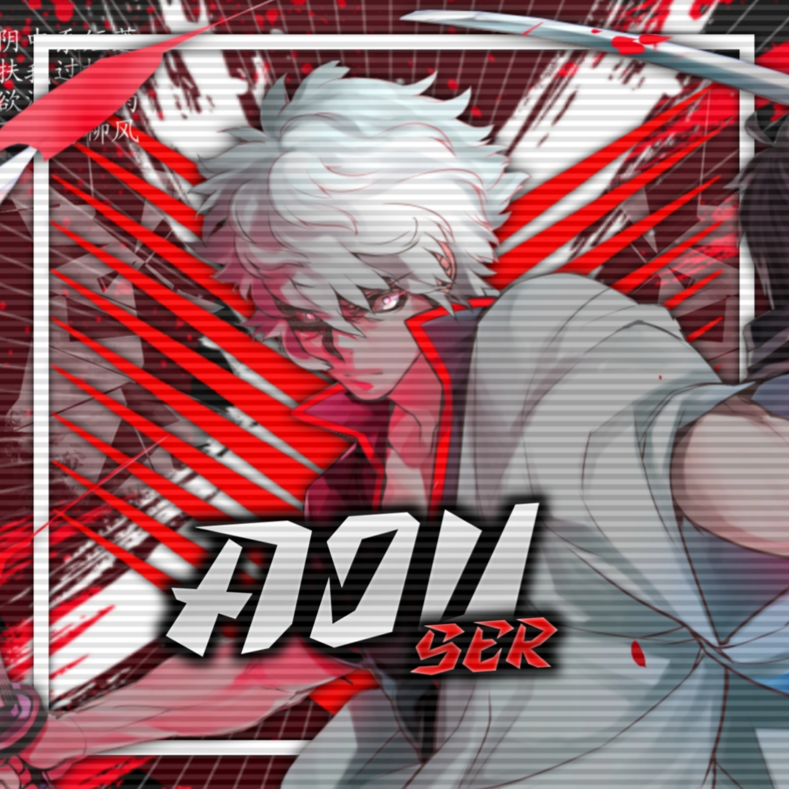

#### UPDATE : REPLIT ADDED SO THERES NO NEED OF TERMUX🔥 COPY THE SESSION AND PASTE IN SESSION.JSON

#### NB : THERE ARE SLIGHT CHANGES IN THE DEPLOYING METHOD COMPARING WITH COMMON ASEENA BOT . SO WATCH THE VIDEO  FULLY THAT I HAVE UPLOADED BY [` CLICKING HERE`](https://youtube.com/channel/UCk4uZXPnYwPSo2YlQECp1RA) OR ELSE MOST PROBABLY YOU WILL GET ERROR !


<div align="center">


## 🚀AJU SER🚀 

</div>

<p align="center">
<a href="##"></a>
</p>
<p align="center">
 <a href="https://github.com/aju001"></a>  <a href="https://Wa.me/+917994873071?text=Hello%20Aju%20Bro🌝...fen%20boi%20aan😌💝"></a>
<p align="center">
<a href="https://chat.whatsapp.com/HebsCx7CBxMJBLqyeHemcO"></a> <a href="https://youtube.com/channel/UCk4uZXPnYwPSo2YlQECp1RA"></a>
</p>


  ### Simple Method
  
  
[](https://replit.com/@aju0011/A-J-U-QR?v=1)

<a href="https://github.com/aju001"></a>

## 🚀

<a href="https://github.com/aju001"></a>

## ERROR FIX IT YOURSELF

[](https://heroku.com/deploy?template=https://github.com/aju001/AJU-SER) 


# Requirements
* [Node.js](https://nodejs.org/en/)
* [Git](https://git-scm.com/downloads)
* [FFmpeg](https://github.com/BtbN/FFmpeg-Builds/releases/download/autobuild-2020-12-08-13-03/ffmpeg-n4.3.1-26-gca55240b8c-win64-gpl-4.3.zip)
* [Libwebp](https://developers.google.com/speed/webp/download)
* Any text editor

## `ADD BUILDPACK`

```
https://github.com/jonathanong/heroku-buildpack-ffmpeg-latest
https://github.com/clhuang/heroku-buildpack-webp-binaries.git
https://github.com/DuckyTeam/heroku-buildpack-imagemagick
heroku/nodejs
```

## `CHANGE SESSION`

[`Click Here`](https://github.com/aju001/AJU-SER/blob/master/session.json#L1)

## `SETTING`

- CHANGE OWNER NUMBER [Here](https://github.com/aju001/AJU-SER/blob/master/index.js#L136)
- CHANGE OWNER NAME [Here](https://github.com/aju001/AJU-SER/blob/master/index.js#L138)

# Installation
## Clone Repo & Installation dependencies
```bash
🚀 git clone https://github.com/aju001/AJU-SER.git
🚀 cd AJU-SER
🚀 npm start
```
## For Termux
```bash
🚀 apt update
🚀 apt upgrade
🚀 pkg update && pkg upgrade 
🚀 pkg install bash
🚀 pkg install libwebp
🚀 pkg install git -y
🚀 pkg install nodejs -y 
🚀 pkg install ffmpeg -y 
🚀 pkg install wget
🚀 pkg install imagemagick -y
🚀 git clone https://github.com/aju001/AJU-SER
🚀 cd AJU-SER
🚀 ls
🚀 rm -rf session.json
🚀 npm install
🚀 npm start
🚀 scan qr code within 15seconds
```


## Connect With Me
My Personal Chat👇
<p align="center">
 <a href="https://wa.me/+917994873071"></a>
</p>

My Whatsapp Group👇
<p align="center">
 <a href="https://chat.whatsapp.com/HebsCx7CBxMJBLqyeHemcO"></a>
</p>

* [`My Youtube Channel`](https://youtube.com/channel/UCk4uZXPnYwPSo2YlQECp1RA)

### ⚠ Warning ⚠

```
By using kick, add, promote, demote Commands, Your WhatsApp account may be banned.
Aju Sir or we are not responsible for your account, 
This bot is intended for the purpose of having fun with some fun commands 
and group management with some helpfull commands.

If  you ended up spamming groups, getting reported left and right, 
and you ended up in being fight with WhatsApp
and at the end WhatsApp Team deleted your account. DON'T BLAME US.

No personal support will be provided / We won't spoon feed you. 
If you need help
you can contact us 
```

  <p align="center">
  <a href="https://github.com/aju001/AJU-SER">
    
<a href="https:https://github.com/aju001?tab=followers">

<p align="center">
<a href="https://github.com/aj001/followers"
</a>
<a href="https://github.com/aju001/AJU-SER/stargazers/"></a>
<a href="https://github.com/aju001/AJU-SER/network/members"></a>
<a href="https://github.com/aju001/AJU-SER/watchers"></a>
</p>

<p align="center">
<p>&nbsp;</p>
    
  <div align="center">
       
  
  </div>
 

  [](https://chat.whatsapp.com/HebsCx7CBxMJBLqyeHemcO)

# Thanks To
* [`Aju`](https://github.com/aju001)
* [`Baileys`](https://github.com/adiwajshing/Baileys)
* [`Xeon`](https://github.com/DGXeon)
